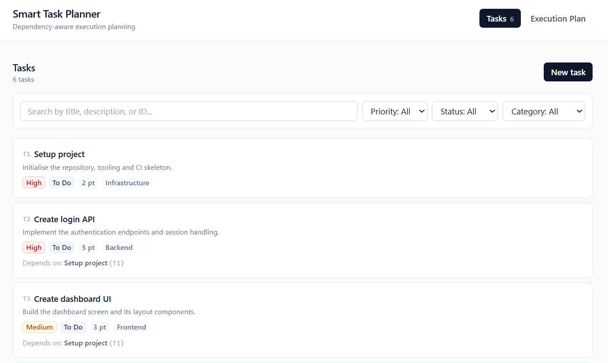
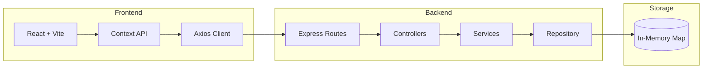
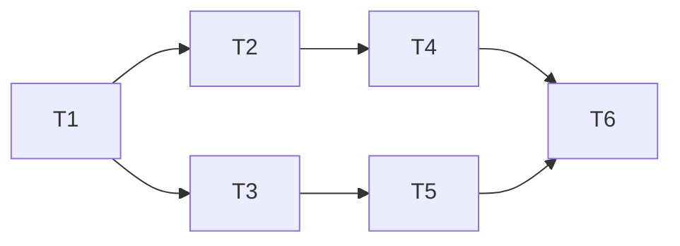
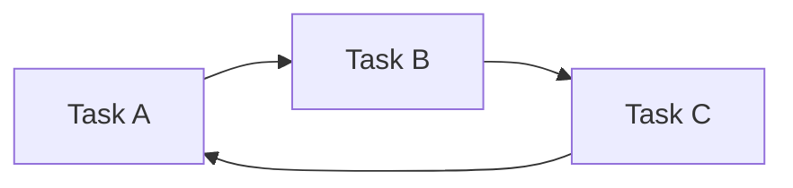
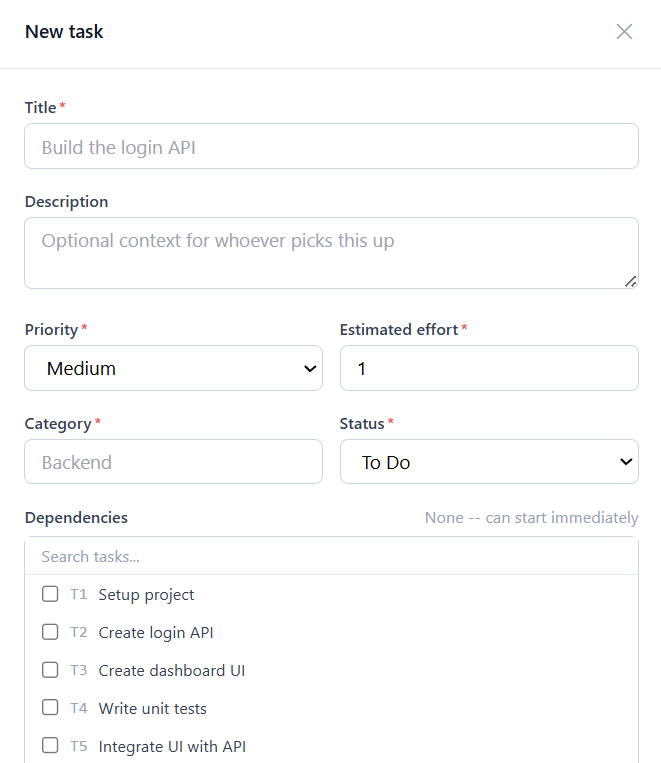
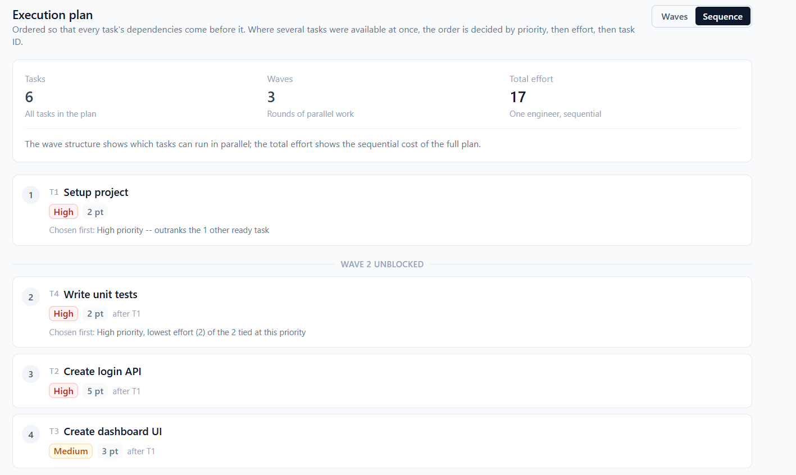
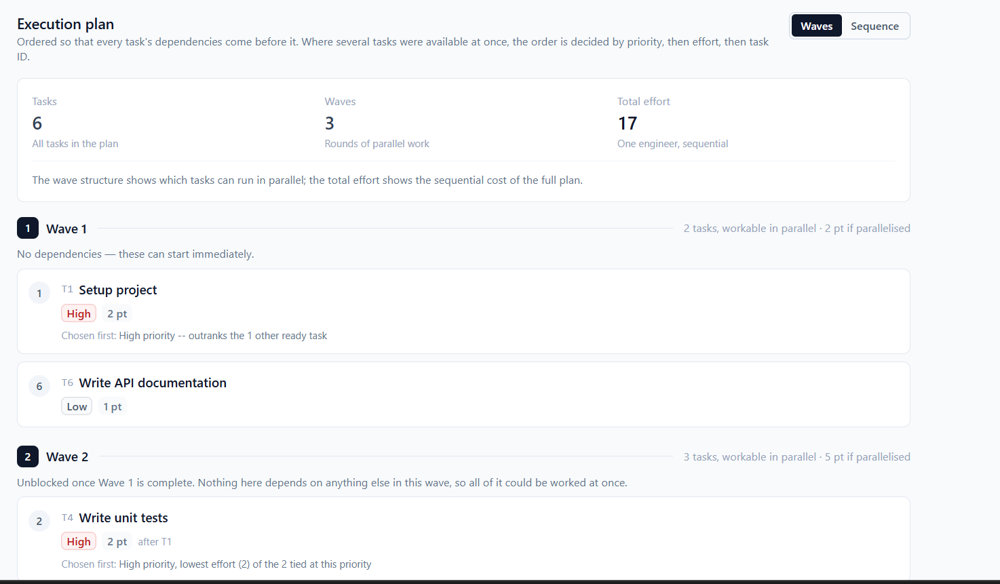

# Smart Task Planner

A full-stack task management application that generates a **deterministic execution plan** from task dependencies. The planner models tasks as a directed graph and computes an execution order using **Kahn's Topological Sorting Algorithm**, while applying business-specific prioritization rules.

The project was developed as part of a **Full Stack Engineering Technical Assessment** with emphasis on:

- Clean Architecture
- Type Safety
- Deterministic Algorithms
- Testability
- Maintainability
- Production-Oriented Design

---

# Assignment Coverage

The implementation satisfies all major requirements of the assessment.

| Requirement | Status |
|-------------|--------|
| Task CRUD Operations | ✅ |
| Dependency Management | ✅ |
| Execution Planning | ✅ |
| Circular Dependency Detection | ✅ |
| Deterministic Ordering | ✅ |
| Validation | ✅ |
| Error Handling | ✅ |
| In-memory Storage | ✅ |
| Unit Testing | ✅ |
| Responsive Frontend | ✅ |

---

# Project Highlights

- Deterministic execution planner using **Kahn's Algorithm**
- Detects and reports circular dependencies with the exact dependency path
- Layered backend architecture
- Repository pattern
- Strong TypeScript typing throughout
- Shared validation using Zod
- Centralized error handling
- Comprehensive backend unit tests
- Responsive React frontend
- Easily replaceable storage layer

---

## Preview



---

# Tech Stack

The technologies were selected to balance simplicity, maintainability, and type safety.

| Technology | Why it was chosen |
|------------|------------------|
| **TypeScript** | Strong compile-time type checking prevents many runtime bugs and keeps the domain model consistent. |
| **React** | Component-based architecture with excellent TypeScript support and ecosystem. |
| **Vite** | Extremely fast development server and optimized production builds. |
| **Express** | Lightweight framework providing full control over application architecture without unnecessary abstractions. |
| **Zod** | Single source of truth for runtime validation and TypeScript inference. |
| **Tailwind CSS** | Rapid UI development without maintaining large CSS files. |
| **Axios** | Centralized HTTP client with interceptors and unified error handling. |
| **Vitest** | Fast test runner that integrates naturally with Vite and TypeScript. |
| **Repository Pattern** | Decouples business logic from storage implementation. |
| **Map Storage** | Meets assignment requirements while keeping storage implementation simple. |
| **Kahn's Algorithm** | Efficient topological sorting with natural cycle detection and deterministic execution planning. |

---

## Architecture




## Backend Design

The backend follows the separation of concerns principle.

| Layer | Responsibility |
|--------|----------------|
| Routes | HTTP endpoint mapping |
| Validators | Structural request validation |
| Controllers | HTTP request/response handling |
| Services | Business logic |
| Repository | Data abstraction |
| Storage | In-memory task storage |

This separation keeps business logic independent from Express, making the application easier to test and maintain.

---

# Why this Architecture?

The project intentionally follows a layered architecture to keep each component focused on a single responsibility.

Some benefits include:

- Controllers remain extremely thin.
- Business rules are fully testable.
- Storage implementation can be replaced without changing business logic.
- Validation is centralized.
- Easier debugging.
- Better maintainability.
- Higher code readability.

---

# Design Principles

The implementation follows several engineering principles throughout the codebase.

- Separation of Concerns
- Single Responsibility Principle
- Fail Fast Validation
- Deterministic Behaviour
- Type Safety
- Extensibility
- Testability
- Clean Error Handling
- Minimal Coupling
- High Cohesion

---

# Repository Layout

```
smart-task-planner/

├── backend/
├── frontend/
├── README.md
└── docs/
    └── screenshots/
```

# Project Structure

The project is organized using a layered architecture where each layer has a clearly defined responsibility. This separation keeps business logic independent from HTTP concerns and makes the application easier to maintain, test, and extend.

## Backend Structure

```text
backend/
└── src/
    ├── app.ts
    ├── server.ts
    ├── config/
    ├── controllers/
    ├── data/
    ├── errors/
    ├── middleware/
    ├── repositories/
    ├── routes/
    ├── services/
    ├── types/
    ├── validators/
    └── utils/
```

# Repository Layout

```
smart-task-planner/

├── backend/
├── frontend/
├── README.md
└── docs/
    └── screenshots/
```

# Project Structure

The project is organized using a layered architecture where each layer has a clearly defined responsibility. This separation keeps business logic independent from HTTP concerns and makes the application easier to maintain, test, and extend.

## Backend Structure

```text
backend/
└── src/
    ├── app.ts
    ├── server.ts
    ├── config/
    ├── controllers/
    ├── data/
    ├── errors/
    ├── middleware/
    ├── repositories/
    ├── routes/
    ├── services/
    ├── types/
    ├── validators/
    └── utils/
```

### app.ts

Creates and configures the Express application.

Responsibilities:

- Registers middleware
- Registers routes
- Configures error handling
- Returns an Express app without starting the server

Separating `app.ts` from `server.ts` allows the application to be tested without opening network ports.

---

### server.ts

The application's entry point.

Responsibilities:

- Loads environment variables
- Starts the HTTP server
- Binds the application to a port

No application logic exists here.

---

### config/

Contains configuration shared across the application.

Examples include:

- Environment loading
- Priority ranking
- Constants
- Enums

Keeping configuration centralized avoids hardcoded values throughout the codebase.

---

### controllers/

Controllers act as HTTP adapters.

Responsibilities:

- Receive HTTP requests
- Call service methods
- Return HTTP responses

Controllers intentionally contain **no business logic**.

Example:

```text
POST /tasks
        ↓
Controller
        ↓
TaskService.createTask()
        ↓
Return JSON Response
```

This keeps controllers small and easy to test.

---

### validators/

Contains Zod schemas used for request validation.

Validation is performed before requests reach the service layer.

Responsibilities:

- Required fields
- Data types
- Enum validation
- Input sanitization

Using Zod provides both runtime validation and compile-time TypeScript types from the same schema.

---

### services/

The service layer contains all business logic.

Examples include:

- CRUD rules
- Dependency validation
- Cycle detection
- Execution planning
- Business-specific ordering rules

This layer is completely independent of Express.

It can be reused by another interface such as GraphQL or gRPC without modification.

---

### repositories/

The repository layer abstracts storage.

Current implementation:

```text
Map<string, Task>
```

Responsibilities:

- Read tasks
- Store tasks
- Update tasks
- Delete tasks

The rest of the application never directly interacts with the Map.

Replacing storage with PostgreSQL only requires implementing another repository.

---

### middleware/

Contains reusable Express middleware.

Examples:

- Request validation
- Error handling
- Route middleware

Error handling is centralized to ensure every API returns a consistent response format.

---

### errors/

Contains application-specific error classes.

Examples:

- AppError
- Error Codes
- HTTP Mapping

Every business error maps to a predictable HTTP response.

---

### routes/

Defines API endpoints.

Responsibilities:

- URL mapping
- Validation middleware
- Controller registration

Routes contain no business logic.

---

### types/

Contains shared TypeScript domain models.

Examples:

- Task
- Priority
- Status
- ExecutionPlan
- ErrorResponse

Keeping domain types centralized improves consistency throughout the project.

---

### data/

Contains sample seed data used during development.

The application automatically loads sample tasks when started.

This allows reviewers to immediately test execution planning without manually creating data.

---

## Frontend Structure

```text
frontend/
└── src/
    ├── api/
    ├── components/
    ├── context/
    ├── hooks/
    ├── pages/
    ├── types/
    ├── utils/
    └── App.tsx
```

---

### api/

Contains all communication with the backend.

Responsibilities:

- Axios configuration
- Request interceptors
- Response interceptors
- Typed endpoint wrappers

Only this layer imports Axios.

Every other component communicates through typed functions.

---

### components/

Contains reusable UI components.

Examples:

- Task Card
- Task Form
- Filters
- Execution Plan
- Modal
- Buttons

These components remain presentation-focused and contain minimal business logic.

---

### pages/

Container components responsible for data loading and page composition.

Responsibilities:

- Fetch data
- Connect context
- Render components

---

### context/

Global application state.

The project uses:

- React Context
- useReducer

This was chosen instead of Redux because the application has a relatively small amount of shared state.

---

### hooks/

Contains reusable custom hooks.

Examples:

- useTasks()
- useTaskFilters()
- useTaskForm()

These encapsulate reusable frontend logic and keep components cleaner.

---

### utils/

Contains helper functions.

Examples:

- Execution plan formatting
- Dependency helpers
- Cycle prediction
- Sorting utilities

---

### types/

Mirrors backend TypeScript types.

Maintaining shared domain models ensures the frontend and backend remain synchronized.

---

# Data Model

Each task represents a unit of work.

```typescript
interface Task {
  id: string;
  title: string;
  description: string;
  priority: "High" | "Medium" | "Low";
  estimatedEffort: number;
  category: string;
  dependencies: string[];
  status: "To Do" | "In Progress" | "Done";
}
```

---

# API Reference

Base URL

```
http://localhost:4000
```

---

## Health Check

### GET /health

Checks whether the backend is running.

Example Response

```json
{
  "status": "OK"
}
```

---

## Get All Tasks

### GET /tasks

Returns every task.

Supports filtering.

Query Parameters

| Parameter | Description |
|------------|-------------|
| search | Search by title |
| priority | Filter by priority |
| status | Filter by status |
| category | Filter by category |

---

## Get Task

### GET /tasks/:id

Returns a single task.

---

## Create Task

### POST /tasks

Creates a new task.

---

## Update Task

### PUT /tasks/:id

Updates an existing task.

---

## Delete Task

### DELETE /tasks/:id

Deletes a task if no other task depends on it.

---

## Generate Execution Plan

### GET /tasks/plan

Returns the deterministic execution order.

Example Response

```json
{
  "entries": [
    {
      "order": 1,
      "wave": 1,
      "task": {
        "id": "T1"
      }
    }
  ],
  "totalTasks": 6,
  "totalEffort": 17,
  "waveCount": 3,
  "excludedCompletedIds": []
}
```

---

# Error Handling

The API follows a consistent error response structure.

```json
{
  "error": {
    "code": "CYCLE_DETECTED",
    "message": "Circular dependency detected.",
    "details": {}
  }
}
```

This predictable format allows the frontend to handle every failure using a single error model.

---

## Error Codes

| Error Code | HTTP Status | Description |
|------------|------------|-------------|
| VALIDATION_ERROR | 400 | Invalid request body |
| UNKNOWN_DEPENDENCY | 400 | Dependency not found |
| SELF_DEPENDENCY | 400 | Task depends on itself |
| TASK_NOT_FOUND | 404 | Requested task does not exist |
| ROUTE_NOT_FOUND | 404 | Unknown endpoint |
| DUPLICATE_TASK_ID | 409 | Duplicate task identifier |
| DEPENDENCY_CONFLICT | 409 | Cannot delete because another task depends on it |
| CYCLE_DETECTED | 409 | Circular dependency exists |
| INTERNAL_ERROR | 500 | Unexpected server error |

---

# Configuration

Both frontend and backend support zero-configuration startup.

Default environment values are provided through `.env.example`.

Backend

```env
PORT=4000

CORS_ORIGIN=http://localhost:5173

NODE_ENV=development
```

Frontend

```env
VITE_API_URL=http://localhost:4000
```

No database or Docker configuration is required since storage is entirely in memory.

---
# Execution Planning Logic

The execution planner is the core component of the application.

Its responsibility is to generate a **deterministic execution order** that:

- Respects all task dependencies
- Detects circular dependencies
- Produces identical output for identical input
- Applies business-specific prioritization rules whenever multiple tasks are ready to execute

---

# Problem Statement

Each task may depend on one or more other tasks.

For example:

```text
T4 depends on T2

↓

T2 must finish before T4 can begin.
```

The challenge is determining a valid execution order for every task while respecting all dependency relationships.

This naturally forms a **Directed Graph (DAG)**.

---

# Graph Representation

Each task is represented as a node.

Each dependency is represented as a directed edge.

Example:



Meaning:

- T2 depends on T1
- T3 depends on T1
- T4 depends on T2
- T5 depends on T3
- T6 depends on both T4 and T5

---

# Why Kahn's Algorithm?

The assignment requires generating an execution order that always respects task dependencies.

This is a classic **Topological Sorting** problem.

Kahn's Algorithm was selected because it:

- Runs in linear time
- Naturally detects cycles
- Produces valid topological ordering
- Allows custom ordering rules whenever multiple tasks become available

This makes it an ideal fit for deterministic execution planning.

---

# High-Level Algorithm

The planner builds the dependency graph, calculates task in-degrees, collects ready tasks, applies deterministic prioritization, removes completed tasks, updates dependent task state, and repeats until the plan completes or a cycle is detected.

---

# Step 1 — Build the Dependency Graph

The planner first constructs a directed graph.

Each dependency creates one edge.

Example:

```text
Task

T4

Dependencies

[T2, T3]
```

Graph:

```text
T2 → T4

T3 → T4
```

---

# Step 2 — Calculate In-Degree

Each task stores the number of unresolved dependencies.

Example

| Task | In-Degree |
|------|-----------|
| T1 | 0 |
| T2 | 1 |
| T3 | 1 |
| T4 | 2 |

Tasks with

```
In-Degree = 0
```

can execute immediately.

These tasks form the **Ready Set**.

---

# Step 3 — Build the Ready Set

Initially every task with zero remaining dependencies is collected.

Example

```
Ready Set

[T1]
```

After T1 completes

```
Ready Set

[T2

T3

T4]
```

Now business rules decide which task executes first.

---

# Business Priority Rules

Whenever multiple tasks are available, the planner applies a deterministic comparator.

Priority Order

1. Higher Priority
2. Lower Estimated Effort
3. Smaller Task ID

Example

| Task | Priority | Effort |
|------|----------|--------|
| T2 | High | 5 |
| T3 | Medium | 3 |
| T4 | High | 2 |

Execution Order

```
T4

↓

T2

↓

T3
```

Reason

- T4 and T2 have equal priority
- T4 requires less effort
- T3 has lower priority

---

# Comparator Logic

Conceptually the planner sorts available tasks using

```text
Priority DESC

↓

Estimated Effort ASC

↓

Task ID ASC
```

This guarantees identical output for identical input.

---

# Step 4 — Execute Task

The selected task is removed from the graph.

Every outgoing edge is deleted.

Example

```
Before

T1 → T2

↓

After Removing T1

T2 In-Degree

1 → 0
```

T2 now becomes ready.

---

# Step 5 — Repeat

The planner repeats the process until

```
Ready Set Empty

AND

All Tasks Processed
```

or

```
Cycle Detected
```

---

# Complete Example

Given

| Task | Depends On |
|------|------------|
| T1 | — |
| T2 | T1 |
| T3 | T1 |
| T4 | T2 |
| T5 | T2 |
| T6 | T3,T5 |

Execution proceeds as

```
Wave 1

T1

↓

Wave 2

T2

T3

↓

Wave 3

T4

T5

↓

Wave 4

T6
```

---

# Parallel Execution Waves

The planner groups tasks into execution waves.

Tasks within the same wave have no dependencies between them.

Example

```
Wave 1

T1

Wave 2

T2

T3

Wave 3

T4

T5
```

Meaning

- T2 and T3 can execute in parallel.
- T4 and T5 can execute in parallel.

The backend returns these wave numbers so the frontend can visualize execution stages.

---

# Completed Tasks

Tasks already marked as **Done** are treated as satisfied dependencies.

Example

```
T1

Status

Done
```

Any task depending on T1 becomes immediately eligible.

Completed tasks are excluded from the returned execution plan but continue satisfying dependency constraints.

---

# Circular Dependency Detection

A valid execution plan exists only if the dependency graph is acyclic.

Example



No task can execute first.

The planner detects this because the Ready Set eventually becomes empty before every task has been processed.

Instead of returning an invalid plan, the API responds with

```json
{
    "error": {
        "code": "CYCLE_DETECTED",
        "message": "Circular dependency detected.",
        "details": {
            "cyclePath": [
                "T1",
                "T2",
                "T5",
                "T1"
            ]
        }
    }
}
```

Providing the exact cycle helps users quickly identify and resolve invalid dependency relationships.

---

## Application Screens

| Tasks | Create Task |
|-------|-------------|
|  |  |

| Execution Plan (Sequence) | Execution Plan (Waves) |
|---------------------------|------------------------|
|  |  |

---

# Deterministic Behaviour

One important design goal is determinism.

Given the same input tasks

↓

The planner always produces

↓

The exact same execution order.

This property simplifies

- Testing
- Debugging
- Reproducibility
- User expectations

---

# Complexity Analysis

Let

- **V** = Number of Tasks
- **E** = Number of Dependencies

| Operation | Complexity |
|-----------|------------|
| Graph Construction | O(V + E) |
| In-Degree Calculation | O(E) |
| Topological Sort | O(V + E) |
| Cycle Detection | O(V + E) |
| Total Planner Complexity | **O(V + E)** |

The planner scales linearly with the size of the dependency graph.

---

# Why This Design?

Several approaches were considered.

| Approach | Reason Not Selected |
|-----------|---------------------|
| Depth First Search Topological Sort | Produces valid ordering but does not naturally support business-rule based ready-set prioritization. |
| Recursive Scheduling | Harder to reason about, more difficult to detect cycles cleanly, and less scalable for large graphs. |
| Kahn's Algorithm | Linear complexity, deterministic ordering, simple cycle detection, and straightforward integration with business priority rules. |

Kahn's Algorithm therefore provided the cleanest and most maintainable solution for the assignment requirements.

# Design Decisions & Trade-offs

This project was designed with a focus on correctness, maintainability, and extensibility rather than adding unnecessary complexity. The following design decisions were made deliberately.

---

## Layered Architecture

The application follows a layered architecture. Each layer is responsible for a single concern, with requests moving from routes to controllers, then services, repository, and finally storage.

### Why?

Separating responsibilities keeps each layer focused on a single concern.

Benefits include:

- Easier testing
- Better maintainability
- Clear separation between HTTP and business logic
- Storage implementation can change without affecting services
- Reduced coupling

---

## Repository Pattern

The service layer never interacts directly with the storage implementation.

Instead, it depends on a repository abstraction.

Current implementation

```text
TaskService

↓

TaskRepository

↓

Map Storage
```

### Why?

This makes replacing the in-memory repository with PostgreSQL or MongoDB straightforward without modifying business logic.

---

## In-Memory Storage

The assignment explicitly requested in-memory storage.

A `Map<string, Task>` was selected because it provides:

- O(1) average lookup
- O(1) insert
- O(1) update
- Simple implementation
- Clear semantics

Although not persistent, it satisfies the assignment while keeping the repository implementation minimal.

---

## Validation Strategy

Validation occurs in two stages.

### Structural Validation

Performed using Zod.

Examples:

- Missing fields
- Invalid enums
- Incorrect data types
- Invalid request body

---

### Business Validation

Performed inside the service layer.

Examples:

- Duplicate IDs
- Unknown dependencies
- Self dependencies
- Circular dependencies
- Delete restrictions

Keeping these concerns separate improves maintainability.

---

## Centralized Error Handling

Every error is converted into a consistent API response.

Instead of returning different response formats from different controllers, the application uses a single error handler.

Benefits:

- Consistent frontend handling
- Predictable API contract
- Reduced duplicate code

---

## Deterministic Planner

One design goal was deterministic behaviour.

The planner always produces identical output for identical input.

This improves:

- Testing
- Debugging
- Reproducibility
- User confidence

---

# Design Trade-offs

Every engineering decision involves trade-offs.

| Decision | Benefit | Trade-off |
|----------|----------|-----------|
| In-memory storage | Simpler implementation | Data lost on restart |
| Context API instead of Redux | Less boilerplate | Not ideal for very large applications |
| Layered architecture | Maintainable and testable | More files than a monolithic implementation |
| Kahn's Algorithm | Efficient and deterministic | Requires graph construction before planning |
| Synchronous repository | Simpler implementation | Would need refactoring for async databases |
| Manual frontend testing | Faster implementation | Less automated UI coverage |

---

# Assumptions

The assignment specification leaves some implementation details open.

The following assumptions were made.

1. Every task has a unique identifier.

2. Dependencies always reference existing tasks.

3. Tasks cannot depend on themselves.

4. The dependency graph must remain acyclic.

5. Completed tasks satisfy dependency requirements.

6. Tasks within the same execution wave can execute independently.

7. The application runs as a single backend instance.

8. Repository operations are synchronous because storage is entirely in memory.

9. Requests are validated before business logic executes.

10. Task effort is represented as a positive numeric estimate.

11. Concurrent updates are outside the scope of this assignment.

---

# Testing Strategy

The majority of testing effort focuses on the backend because it contains all business logic.

Run the test suite.

```bash
cd backend

npm test
```

Example Output

```text
Test Files 8 passed

Tests 163 passed
```

---

## Test Coverage

The following scenarios are covered.

### Planner

- Topological sorting
- Dependency ordering
- Priority ordering
- Effort ordering
- Deterministic output
- Wave generation

---

### Dependency Validation

- Missing dependency
- Duplicate dependency
- Self dependency
- Deep dependency chains

---

### Cycle Detection

- Simple cycle
- Multi-node cycle
- Exact cycle path reporting

---

### CRUD Operations

- Create task
- Update task
- Delete task
- Duplicate task ID
- Unknown task

---

### Error Handling

- Invalid payloads
- Invalid routes
- Validation failures
- Repository failures

---

### API Behaviour

- Route resolution
- Response format
- Error envelope
- Health endpoint

---

## Testing Philosophy

Business logic is isolated inside the service layer.

This allows the most critical functionality to be tested independently from Express or the frontend.

Frontend behaviour was verified manually during development.

Given additional time, React Testing Library would be added for component and interaction testing.

---

# Complexity Summary

| Operation | Complexity |
|-----------|------------|
| Create Task | O(1) |
| Update Task | O(1) |
| Delete Task | O(n) |
| Lookup Task | O(1) |
| Graph Construction | O(V + E) |
| Execution Planning | O(V + E) |
| Cycle Detection | O(V + E) |

---

# Future Improvements

The current implementation satisfies the assessment requirements while leaving several opportunities for future enhancement.

### Storage

- PostgreSQL
- MongoDB
- Redis

---

### Scalability

- Asynchronous repository
- Pagination
- Lazy loading
- Request size limits
- Priority queue for larger ready sets

---

### Authentication

- JWT authentication
- Role-based authorization
- User-specific task ownership

---

### Reliability

- Optimistic concurrency control
- Request idempotency
- Retry mechanisms

---

### Observability

- Structured logging
- Request IDs
- Metrics
- Health monitoring
- Distributed tracing

---

### Frontend

- React Testing Library
- Error Boundaries
- List virtualization
- Offline support
- Dark mode

---

### Deployment

- Docker
- GitHub Actions
- CI/CD pipeline
- Environment-based configuration
- Cloud deployment

---

# Production Considerations

If this application were deployed in production, the following improvements would be prioritized.

- Persistent database
- Authentication
- Authorization
- HTTPS
- Rate limiting
- API versioning
- Request logging
- Monitoring
- Automatic backups
- Horizontal scaling

The current architecture was intentionally designed so these features can be added without major changes to the business layer.

---

# AI Usage

AI-assisted tools were used during development to:

- Review architecture ideas
- Improve documentation
- Validate implementation approaches
- Proofread code comments

All application architecture, business logic, execution planning, testing strategy, debugging, and final implementation decisions were manually designed, implemented, and verified.

---

# Submission Notes

This project was developed as part of a Full Stack Engineering Technical Assessment.
The primary objective was not only to satisfy the functional requirements but also to demonstrate:

- Clean architecture
- Algorithmic correctness
- Maintainable code
- Type safety
- Extensibility
- Production-oriented engineering practices

Special attention was given to ensuring that the execution planner remains deterministic, testable, and independent of the HTTP layer.

---

# License
This project is submitted solely for evaluation as part of a software engineering recruitment process.
Feel free to review the implementation, architecture, and test suite.

---

## Thank You
Thank you for taking the time to review this submission.
Feedback is always appreciated.
